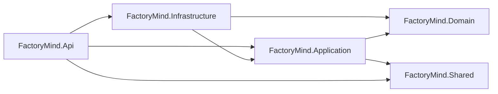
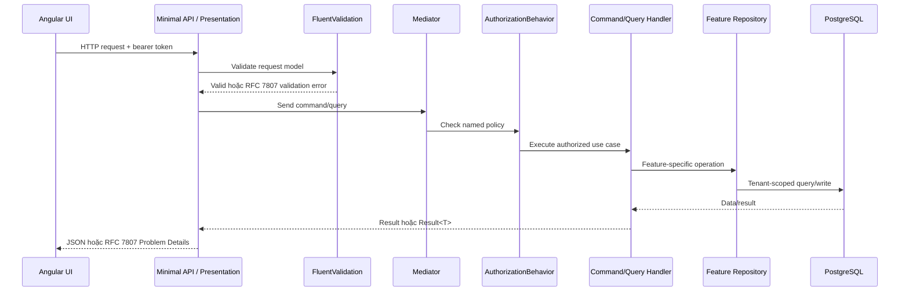
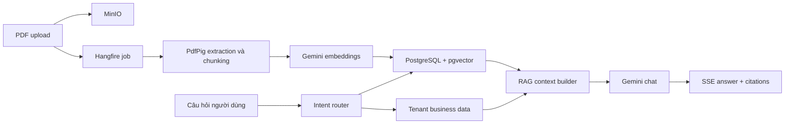
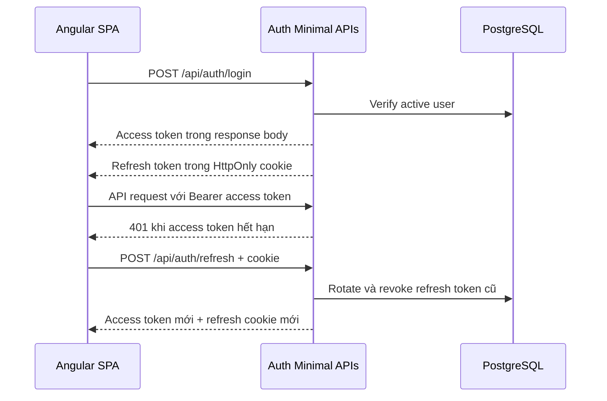
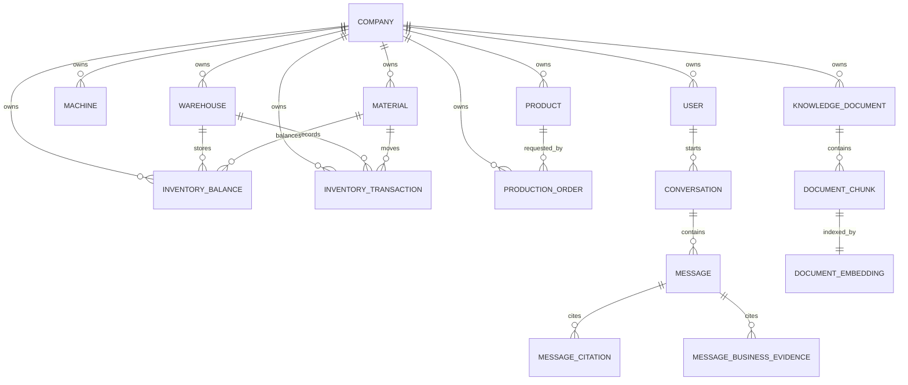

# FactoryMind

[](https://github.com/johnvo402/factory-mind/actions/workflows/ci.yml)

FactoryMind là MVP quản trị dữ liệu nhà máy kết hợp AI. Hệ thống quản lý máy móc, nguyên liệu, sản phẩm, tồn kho và lệnh sản xuất; đồng thời dùng Google Gemini và RAG để trả lời câu hỏi dựa trên dữ liệu doanh nghiệp hoặc tài liệu PDF có trích dẫn.

## Mục lục

- [Bài toán dự án giải quyết](#factorymind-giải-quyết-bài-toán-gì)
- [Đối tượng sử dụng](#đối-tượng-sử-dụng)
- [Phạm vi MVP](#phạm-vi-mvp)
- [Module và chức năng](#module-và-chức-năng-hiện-có)
- [Kiến trúc](#kiến-trúc)
- [Công nghệ](#công-nghệ-được-áp-dụng)
- [Yêu cầu môi trường](#yêu-cầu-môi-trường)
- [Cấu hình](#cấu-hình-quan-trọng)
- [Chạy local](#chạy-local)
- [API](#nhóm-api-chính)
- [Kiểm thử](#chạy-kiểm-thử)
- [Production và CI/CD](#production-containers)
- [Bảo mật](#bảo-mật)
- [Tài liệu](#tài-liệu)

## FactoryMind giải quyết bài toán gì?

FactoryMind hướng tới doanh nghiệp sản xuất nhỏ và vừa đang lưu thông tin rải rác trong Excel, PDF, SOP, hệ thống nội bộ hoặc kinh nghiệm của nhân sự lâu năm. Những câu hỏi đơn giản như “máy nào đang sẵn sàng?”, “kho còn bao nhiêu PP?” hoặc “quy trình reset máy nằm ở đâu?” thường cần mở nhiều file hoặc hỏi nhiều người.

FactoryMind tạo một lớp AI nằm trên dữ liệu hiện có để người dùng có thể:

- Hỏi dữ liệu nhà máy bằng ngôn ngữ tự nhiên.
- Tìm nhanh SOP, manual và tài liệu nội bộ.
- Xem bằng chứng nghiệp vụ hoặc trang tài liệu đứng sau câu trả lời.
- Quản lý dữ liệu vận hành cơ bản khi doanh nghiệp chưa có ERP/MES đầy đủ.
- Import dữ liệu hiện có từ Excel thay vì nhập lại thủ công.

FactoryMind không thay thế ERP, MES hoặc con người ra quyết định. AI chỉ tổng hợp context đã được tenant-scope và hỗ trợ người dùng tìm hiểu dữ liệu nhanh hơn.

## Đối tượng sử dụng

| Đối tượng | Nhu cầu chính | Chức năng liên quan |
| --- | --- | --- |
| Chủ doanh nghiệp / Director | Xem nhanh tình trạng vận hành | Chat, KPI dashboard, production orders |
| Quản lý sản xuất | Theo dõi máy, lệnh sản xuất và SOP | Chat, Machines, Production Orders, Knowledge |
| Quản lý kho | Kiểm tra nguyên liệu và tồn kho | Chat, Materials, Inventory, Excel import |
| Nhân viên vận hành | Tra cứu quy trình và dữ liệu được phép xem | Chat, Knowledge |
| Quản trị hệ thống | Quản lý Company, users và trạng thái AI | Settings, re-index, role management |

## Phạm vi MVP

MVP tập trung vào một Company trên mỗi tenant context, quy mô khoảng 10–100 người dùng và dữ liệu không yêu cầu đồng bộ thời gian thực.

Trong phạm vi:

- AI chat cho dữ liệu sản xuất và tài liệu nội bộ.
- PDF knowledge base và semantic retrieval.
- CRUD/import các master data quan trọng.
- Tenant isolation và role-based authorization.
- Dashboard dạng KPI tổng quan.
- Deployment bằng Docker Compose trên một máy chủ.

Ngoài phạm vi hiện tại:

- IoT ingestion và machine telemetry thời gian thực.
- Predictive maintenance, Digital Twin hoặc mô hình ML tự huấn luyện.
- AI agent tự hành, workflow engine hoặc auto scheduling.
- Multi-factory hierarchy, mobile application và ERP connector tự động.
- OCR cho PDF chỉ chứa hình ảnh.

## Module và chức năng hiện có

| Module | Mô tả triển khai | Quyền truy cập |
| --- | --- | --- |
| Authentication | Login, refresh-token rotation, logout và restore session khi SPA khởi động | Public cho login/refresh; logout theo session |
| Chat | Conversation history, Markdown an toàn, Gemini streaming qua SSE | Mọi user đã đăng nhập |
| Hybrid RAG | Route câu hỏi thành `Business`, `Knowledge` hoặc `Hybrid`; trả `[B#]` evidence và `[S#]` citations | Mọi user đã đăng nhập |
| Knowledge | Upload PDF tối đa 100 MB, xem trạng thái, retry processing, semantic search và re-index | User upload/search; Manager/Admin re-index |
| Machines | Quản lý mã máy, tên và trạng thái vận hành | Manager/Admin |
| Materials | Quản lý nguyên liệu và đơn vị tính | Manager/Admin |
| Products | Quản lý danh mục sản phẩm | Manager/Admin |
| Inventory | Warehouse master data, immutable stock ledger, current balances và receive/issue/adjust/transfer | Manager/Admin |
| Production Orders | Quản lý order number, Product, quantity và lifecycle status | Manager/Admin |
| Excel Import | Preview header/rows, gợi ý mapping, validate toàn file và import transaction | Manager/Admin |
| Dashboard | Active orders, inventory balances, available/total machines và alerts | Mọi user đã đăng nhập |
| Settings | Company, tenant users, roles và AI metadata không lộ key | Admin |
| Production delivery | API image, Angular/Nginx image, internal PostgreSQL/MinIO và health checks | Vận hành hệ thống |

## Kiến trúc

Backend áp dụng Clean Architecture Lite, CQRS và Repository Pattern theo từng feature. Dự án không dùng generic repository, generic Unit of Work, event bus hoặc database read/write tách biệt trong MVP.

```text
FactoryMind.Api             Presentation: Minimal APIs, auth, RFC 7807, SSE
FactoryMind.Application     CQRS commands/queries, handlers, policies, validators
FactoryMind.Domain          Entities, domain constants và constraints
FactoryMind.Infrastructure  EF Core, repositories, Gemini, MinIO, Hangfire, PDF/Excel
FactoryMind.Shared          Result, Error và contracts dùng chung thực sự
FactoryMind.Tests           Backend unit tests
frontend                    Angular application và frontend tests
docs                        Product, architecture, sprint và decision logs
```

Mỗi layer sở hữu service registration có `DependencyInjection.cs` riêng. `Program.cs` chỉ compose các layer và map endpoint groups.

### Trách nhiệm từng layer

| Layer | Được phép chứa | Không nên chứa |
| --- | --- | --- |
| `FactoryMind.Domain` | Entities, status constants, domain constraints | EF Core, HTTP, DI hoặc provider SDK |
| `FactoryMind.Application` | Commands, queries, handlers, validators, policies, repository interfaces | SQL, MinIO, Gemini HTTP protocol hoặc endpoint mapping |
| `FactoryMind.Infrastructure` | EF repositories, migrations, external clients, file parsing, background jobs | HTTP response mapping hoặc UI concerns |
| `FactoryMind.Api` | Minimal endpoints, authentication, cookies, RFC 7807, SSE serialization | Business rules hoặc direct EF queries |
| `FactoryMind.Shared` | `Result`, `Error` và framework-independent contracts dùng bởi nhiều project | Feature-specific models hoặc infrastructure helpers |
| `frontend` | Presentation, client state, access-token memory store, API/SSE transport | Provider secrets hoặc server-side business rules |

Dependency direction của backend:



### Luồng một CQRS request



Các quy ước quan trọng:

- Command thay đổi state; Query chỉ đọc state.
- Handler trả `Result`/`Result<T>` cho expected failures.
- Repository interface mô tả đúng intent của feature, không dùng `IRepository<T>` chung.
- EF Core `DbContext` đóng vai trò transaction boundary; không bọc thêm generic Unit of Work.
- Mọi truy vấn business phải filter `CompanyId` trước khi order, limit hoặc projection.
- Endpoint paths tập trung trong `ApiRoutes`, không lặp literal `/api/...` trong endpoint classes.

### Cấu trúc một vertical slice

Ví dụ feature Machines:

```text
src/
├─ FactoryMind.Application/Features/Machines/
│  ├─ CreateMachine/
│  │  ├─ CreateMachineCommand.cs
│  │  └─ CreateMachineCommandHandler.cs
│  ├─ GetMachines/
│  ├─ UpdateMachine/
│  ├─ DeleteMachine/
│  └─ MachineContracts.cs
├─ FactoryMind.Infrastructure/Persistence/Machines/
│  └─ EfMachineRepository.cs
└─ FactoryMind.Api/Endpoints/
   ├─ MachineEndpoints.cs
   └─ MachineRequests.cs
```

Application khai báo repository interface gần feature contract; Infrastructure cung cấp EF implementation; Presentation chỉ validate/map HTTP và dispatch qua Mediator. Cách tổ chức này giữ feature dễ tìm mà không tạo thêm project hoặc abstraction cho từng use case.

### Luồng RAG



### AI và retrieval được áp dụng như thế nào?

FactoryMind gọi trực tiếp native Gemini REST API, không dùng OpenAI-compatible client.

- Chat gọi `streamGenerateContent` với model `gemini-3.5-flash-lite` và chuyển từng token thành SSE event.
- Document chunks dùng `gemini-embedding-2` với task `RETRIEVAL_DOCUMENT`.
- Câu hỏi tìm kiếm dùng cùng embedding model với task `RETRIEVAL_QUERY`.
- Embedding được chuẩn hóa về 1.536 chiều và lưu trong PostgreSQL bằng pgvector.
- Knowledge retrieval lấy tối đa 5 chunks gần nhất bằng cosine distance, giữ page number để tạo citation.
- Business retrieval chỉ đọc các projection nhỏ từ bảng liên quan, không gửi toàn bộ database hoặc entity graph cho Gemini.
- Context được giới hạn kích thước; model được yêu cầu không bịa dữ liệu và phải nói không biết khi context không đủ.
- Chỉ `[B#]` hoặc `[S#]` thực sự xuất hiện trong câu trả lời cuối mới được persist và trả về UI.
- Khi đổi embedding model, Manager/Admin phải chạy explicit re-index để không trộn vector từ hai model space.

SSE stream có các event semantic sau:

| Event | Nội dung |
| --- | --- |
| `conversation` | Conversation ID đang nhận câu trả lời |
| `token` | Một phần nội dung Gemini vừa sinh |
| `business-evidence` | Snapshot dữ liệu nghiệp vụ được trích dẫn |
| `citations` | Document/page/chunk sources được trích dẫn |
| `done` | Stream đã hoàn tất |
| `error` | Lỗi provider xảy ra sau khi response stream đã bắt đầu |

### Authentication và tenant isolation

Access token có thời gian sống ngắn và chỉ nằm trong Angular in-memory store. Refresh token được hash trong PostgreSQL; raw token chỉ tồn tại trong cookie `HttpOnly`, `SameSite=Strict`, scope `/api/auth` và bật `Secure` ngoài Development.



Tenant identity được lấy từ authenticated claims. Client không được tự truyền một `CompanyId` để truy cập dữ liệu tenant khác. Conversation còn được scope thêm theo `UserId`, vì lịch sử chat là dữ liệu riêng của từng user.

### Data model cốt lõi



Một số invariant quan trọng:

- Business code/number là duy nhất trong từng Company, không phải global.
- Inventory balance duy nhất theo `CompanyId + WarehouseId + MaterialId`; mọi thay đổi balance phải có transaction giải thích.
- Production Order phải tham chiếu Product thuộc cùng Company.
- Product/Material đang được tham chiếu không bị xóa làm mất lịch sử nghiệp vụ.
- Document search chỉ dùng chunks của document `ready`, đúng Company và đúng embedding model hiện tại.
- Citations/evidence trong Message là immutable snapshots để lịch sử chat không đổi khi dữ liệu nguồn được cập nhật sau này.

## Công nghệ được áp dụng

| Công nghệ | Phiên bản / lựa chọn | Được dùng ở đâu | Lý do lựa chọn |
| --- | --- | --- | --- |
| ASP.NET Core | .NET 9, Minimal APIs | Presentation, auth, SSE, health check | Nhẹ, typed, phù hợp API theo vertical slices |
| CQRS | Commands/Queries tách riêng | Application use cases | Tách rõ read/write intent mà chưa cần microservices |
| Mediator | `Mediator` 3.0.2 source generator | Dispatch handler và pipeline behaviors | Giảm reflection/runtime overhead, hỗ trợ authorization behavior |
| FluentValidation | 12.1.1 | Command/request validation | Validation tập trung, endpoint không chứa business validation |
| Result Pattern | `FactoryMind.Shared` | Expected success/failure flow | Không dùng exception cho validation/not-found/conflict thông thường |
| RFC 7807 | ASP.NET Core Problem Details | Toàn bộ HTTP failures | Error response nhất quán, có `traceId`, status và message rõ ràng |
| EF Core | 9.x + Npgsql | Persistence và migrations | Mapping strongly typed, LINQ projection, transaction boundary rõ ràng |
| PostgreSQL | 17 | Users, business data, chat, Hangfire, document metadata | Một relational database đủ cho MVP và hỗ trợ transaction tốt |
| pgvector | PostgreSQL extension | Document embeddings và cosine search | Không cần triển khai thêm vector database riêng |
| Google Gemini | Native REST API | Chat streaming và embeddings | Provider duy nhất của MVP, không phụ thuộc OpenAI compatibility layer |
| Hangfire | PostgreSQL storage | PDF parsing/chunking/embedding jobs | Job bền vững qua restart và có retry control |
| MinIO | S3-compatible object storage | Lưu file PDF gốc | Database chỉ lưu object key/metadata, dễ chuyển sang S3-compatible service |
| PdfPig | 0.1.15 | Trích xuất text và page number từ PDF | Giữ page provenance cho citations, không phụ thuộc service ngoài |
| ClosedXML | 0.105.1 | Đọc `.xlsx`, preview và import | API rõ ràng, phù hợp workbook business thông thường |
| Angular | 20.3.x | SPA presentation | Standalone components, Signals và typed forms/services |
| Angular Signals | Angular built-in | Auth/chat/business stores | State cục bộ rõ ràng, không cần thêm global state framework |
| RxJS | 7.8.x | HTTP flows và async composition | Tích hợp tự nhiên với Angular; SSE POST dùng native `fetch` riêng |
| marked + Angular sanitizer | marked 18.x | Render assistant Markdown | Hiển thị Markdown nhưng vẫn để Angular sanitize model output |
| SCSS | Angular component styles | Responsive desktop-first UI | Styling trực tiếp, chưa thêm UI framework không cần thiết |
| Nginx | 1.28.3 Alpine | Production SPA/static hosting và `/api` proxy | Same-origin deployment, hỗ trợ tắt buffering cho SSE |
| Docker Compose | Local và production topology | PostgreSQL, MinIO, API, frontend | Reproducible setup, phù hợp single-VPS MVP |
| GitHub Actions + GHCR | CI/CD | Build, test, audit, artifacts và container images | Gate chất lượng và tạo image theo branch/SHA |

Redis hiện chưa được triển khai vì chưa có use case cache/session được đo lường.

### Frontend được tổ chức như thế nào?

Frontend dùng Angular standalone components và feature folders. API transport, client state và rendering được tách riêng:

- `AuthService` quản lý login/refresh/logout; access token và profile chỉ nằm trong memory.
- HTTP interceptor gắn bearer token, thực hiện một shared refresh khi gặp 401 và retry request đúng một lần.
- Feature stores dùng Signals để quản lý loading, error, entity list và optimistic chat state.
- `ChatApiService` dùng native `fetch` cho SSE vì chat endpoint là authenticated `POST` có JSON body; `EventSource` chuẩn không đáp ứng use case này.
- Assistant Markdown được compile bằng `marked`, sau đó bind qua Angular `[innerHTML]` để Angular sanitizer tiếp tục loại bỏ HTML nguy hiểm.
- Navigation được render theo role: User tập trung Chat/Knowledge, Manager có Data/Import, Admin có thêm Settings.
- KPI failure được cô lập khỏi Chat; người dùng vẫn chat được và có thể retry dashboard riêng.

### Validation và error handling

Request đi qua FluentValidation trước khi dispatch handler. Expected failures dùng `Result` và được Presentation chuyển thành `application/problem+json` theo RFC 7807.

```json
{
  "type": "https://www.rfc-editor.org/rfc/rfc9110#section-15.5.1",
  "title": "Validation failed",
  "status": 400,
  "detail": "One or more request fields are invalid.",
  "instance": "/api/auth/login",
  "traceId": "...",
  "errors": {
    "Email": ["Email is invalid."]
  }
}
```

Unexpected exceptions được xử lý tập trung bởi ASP.NET Core `IExceptionHandler`. API chỉ trả một message rõ ràng trong `detail`, không trả song ngữ và không làm lộ stack trace hoặc provider secrets.

## Yêu cầu môi trường

- [.NET SDK 9](https://dotnet.microsoft.com/download/dotnet/9.0)
- Node.js `24.18.1` và npm
- Docker Desktop có Docker Compose
- Chrome hoặc Chromium để chạy frontend tests
- Gemini API key cho chat và embeddings

Kiểm tra phiên bản:

```powershell
dotnet --version
node --version
npm --version
docker compose version
```

## Cấu hình quan trọng

.NET dùng chuẩn configuration key với `__` để biểu diễn nested section trong environment variables.

| Biến | Mục đích | Local mặc định | Secret |
| --- | --- | --- | --- |
| `ConnectionStrings__FactoryMind` | Kết nối PostgreSQL của API | `localhost:5432/factorymind` | Có password |
| `POSTGRES_DB` | Database được local/production Compose tạo | `factorymind` | Không |
| `POSTGRES_USER` | PostgreSQL user | `postgres` local | Có tính nhạy cảm |
| `POSTGRES_PASSWORD` | PostgreSQL password | `postgres` local | Có |
| `Minio__Endpoint` | S3-compatible endpoint API sử dụng | `localhost:9000` | Không |
| `Minio__AccessKey` | MinIO access key | `minioadmin` local | Có |
| `Minio__SecretKey` | MinIO secret key | `minioadmin` local | Có |
| `Minio__Bucket` | Bucket chứa PDF | `factorymind` | Không |
| `GEMINI_API_KEY` | Gemini chat và embedding credential | Không có | Có |
| `Gemini__BaseUrl` | Native Gemini API base URL | Google Generative Language API | Không |
| `Gemini__ChatModel` | Model sinh câu trả lời | `gemini-3.5-flash-lite` | Không |
| `Gemini__EmbeddingModel` | Model tạo vector | `gemini-embedding-2` | Không |
| `Jwt__Key` / `JWT_KEY` | Ký access token | Development key chỉ dành local | Có |
| `BootstrapAdmin__*` / `BOOTSTRAP_*` | Tạo Company/Admin đầu tiên khi production DB trống | Không dùng trong Development | Có |

Thứ tự khuyến nghị cho secrets:

1. `.env.local` chỉ trên máy phát triển.
2. .NET User Secrets nếu chỉ chạy API từ host.
3. Secret manager hoặc protected deployment environment cho Production.

Không đưa provider key vào Angular environment, browser storage hoặc Settings API.

## Chạy local

Các lệnh dưới đây được chạy từ thư mục gốc repository.

### 1. Tạo cấu hình local

```powershell
Copy-Item .env.example .env.local
```

Mở `.env.local` và cấu hình ít nhất:

```dotenv
GEMINI_API_KEY=your-local-gemini-key
```

`.env.local` đã được Git ignore. Không commit, log hoặc gửi API key lên repository.

### 2. Khởi động PostgreSQL và MinIO

```powershell
docker compose --env-file .env.local up -d
docker compose ps
```

Hai service phải có trạng thái `healthy` trước khi chạy API.

### 3. Chạy backend

Mở một PowerShell terminal mới tại thư mục gốc:

```powershell
Get-Content .env.local | ForEach-Object {
    if ($_ -and -not $_.TrimStart().StartsWith('#')) {
        $factoryMindPair = $_ -split '=', 2
        if ($factoryMindPair.Count -eq 2 -and $factoryMindPair[1].Length -gt 0) {
            Set-Item "Env:$($factoryMindPair[0].Trim())" $factoryMindPair[1]
        }
    }
}

dotnet run --project src/FactoryMind.Api
```

API tự động áp dụng EF Core migrations khi khởi động. Trong `Development`, initializer bổ sung idempotent các demo records còn thiếu mà không yêu cầu xóa volume.

### 4. Chạy frontend

Mở terminal khác:

```powershell
Set-Location frontend
npm ci
npm start -- --host 127.0.0.1 --port 4200
```

Angular development server proxy `/api` tới API tại `http://localhost:5047`.

### 5. Truy cập ứng dụng

| Dịch vụ | URL |
| --- | --- |
| FactoryMind UI | [http://127.0.0.1:4200](http://127.0.0.1:4200) |
| API health | [http://localhost:5047/health](http://localhost:5047/health) |
| MinIO Console | [http://localhost:9001](http://localhost:9001) |
| MinIO S3 API | `http://localhost:9000` |
| PostgreSQL | `localhost:5432` |

## Tài khoản Development

Các tài khoản dưới đây chỉ được tạo trong môi trường `Development` và dùng chung password `Demo@123`.

| Role | Email |
| --- | --- |
| Admin | `admin@factorymind.local` |
| Manager | `manager@factorymind.local` |
| User | `operator@factorymind.local` |

Development seed gồm:

- 1 Company
- 3 Users
- 6 Machines với nhiều trạng thái
- 5 Materials
- 4 Products
- 3 Warehouses (`WH-RAW`, `WH-FG`, `WH-WIP`)
- 6 Inventory balances tại nhiều kho
- 6 opening Inventory transactions
- 5 Production Orders với nhiều trạng thái

Demo credentials và demo business records không được seed trong Production.

## Nhóm API chính

Tất cả business endpoints dùng prefix `/api` và tenant được lấy từ authenticated user, không nhận `CompanyId` tùy ý từ client.

| Route | Method chính | Chức năng | Policy |
| --- | --- | --- | --- |
| `/api/auth/login` | `POST` | Xác thực và cấp access/refresh token | Anonymous |
| `/api/auth/refresh` | `POST` | Rotate refresh token và cấp access token mới | Refresh cookie |
| `/api/auth/logout` | `POST` | Revoke refresh token và xóa cookie | Session hiện tại |
| `/api/conversations` | `GET`, `POST` | Danh sách hoặc tạo conversation | Authenticated |
| `/api/conversations/{id}/messages` | `GET` | Lịch sử message, citations và evidence | Conversation owner |
| `/api/conversations/{id}/messages/stream` | `POST` | Gemini POST streaming bằng SSE | Conversation owner |
| `/api/documents` | `GET`, `POST` | Danh sách và upload PDF | Authenticated |
| `/api/documents/{id}/process` | `POST` | Queue/retry document processing | Authenticated |
| `/api/documents/reindex` | `POST` | Queue re-index ready documents | Manager/Admin |
| `/api/knowledge/search` | `POST` | Semantic search theo Company | Authenticated |
| `/api/dashboard/summary` | `GET` | Tenant KPI summary | Authenticated |
| `/api/imports/excel/preview` | `POST` | Đọc workbook, preview và gợi ý mapping | Manager/Admin |
| `/api/imports/excel/import` | `POST` | Validate và transactional import | Manager/Admin |
| `/api/machines` | `GET`, `POST`, `PUT`, `DELETE` | Machine CRUD | Manager/Admin |
| `/api/materials` | `GET`, `POST`, `PUT`, `DELETE` | Material CRUD | Manager/Admin |
| `/api/products` | `GET`, `POST`, `PUT`, `DELETE` | Product CRUD | Manager/Admin |
| `/api/warehouses` | `GET`, `POST`, `PUT`, `DELETE` | Warehouse CRUD; DELETE deactivates | Manager/Admin |
| `/api/inventories` | `GET` | Current tenant-scoped balances | Manager/Admin |
| `/api/inventories/transactions` | `GET` | Filtered, paged inventory ledger history | Manager/Admin |
| `/api/inventories/receive`, `/issue`, `/adjust`, `/transfer` | `POST` | Atomic stock operations | Manager/Admin |
| `/api/production-orders` | `GET`, `POST`, `PUT`, `DELETE` | Production Order CRUD | Manager/Admin |
| `/api/settings/company` | `GET`, `PUT` | Company settings | Admin |
| `/api/settings/users` | `GET`, `POST`, `PUT` | Tenant user management | Admin |
| `/api/settings/ai` | `GET` | Model metadata và key readiness, không trả key | Admin |

Endpoint contracts và route constants nằm trong `FactoryMind.Api/Routing/ApiRoutes.cs`.

## Chạy kiểm thử

### Backend

```powershell
dotnet restore FactoryMind.sln
dotnet format FactoryMind.sln --verify-no-changes --no-restore
dotnet build FactoryMind.sln --configuration Release --no-restore --warnaserror
dotnet test FactoryMind.sln --configuration Release --no-build --no-restore
```

### Frontend

```powershell
Set-Location frontend
npm ci
npm audit --omit=dev
npm run build
npm test -- --watch=false --browsers=ChromeHeadless
```

## Integration tests

Backend integration tests boot the real ASP.NET Core API against an isolated
PostgreSQL 17 Testcontainer. The container image includes pgvector, so a local
PostgreSQL installation is not required. Docker must be running. The assembly
runs sequentially and resets deterministic tenant data before each test so no
test depends on execution order while the container is shared.

```powershell
dotnet test tests/FactoryMind.IntegrationTests/FactoryMind.IntegrationTests.csproj
```

## Dừng hoặc reset local

Dừng API và frontend bằng `Ctrl+C` trong terminal tương ứng.

Dừng containers nhưng giữ dữ liệu:

```powershell
docker compose --env-file .env.local down
```

Xóa toàn bộ PostgreSQL và MinIO local data chỉ khi chủ động reset demo:

```powershell
docker compose --env-file .env.local down --volumes
```

Lệnh `--volumes` không thể khôi phục dữ liệu đã xóa.

## Production containers

Tạo file secrets riêng cho môi trường triển khai:

```powershell
Copy-Item .env.example .env.production
```

Cấu hình tối thiểu trong `.env.production`:

- `POSTGRES_PASSWORD`
- `MINIO_ROOT_USER`
- `MINIO_ROOT_PASSWORD`
- `JWT_KEY` mạnh, tối thiểu 32 ký tự và không dùng development key
- `GEMINI_API_KEY`
- `BOOTSTRAP_COMPANY_NAME`, `BOOTSTRAP_ADMIN_NAME`, `BOOTSTRAP_ADMIN_EMAIL`, `BOOTSTRAP_ADMIN_PASSWORD` khi database còn trống

Validate và chạy production topology:

```powershell
docker compose --env-file .env.production -f compose.prod.yaml config
docker compose --env-file .env.production -f compose.prod.yaml up -d --build
docker compose --env-file .env.production -f compose.prod.yaml ps
```

Production topology chỉ publish cổng Nginx frontend. Nginx phục vụ Angular và reverse proxy `/api` tới API private; PostgreSQL và MinIO chỉ nằm trong internal network.

Sau lần khởi tạo database đầu tiên, xóa các biến `BOOTSTRAP_*` khỏi deployment environment. API không đọc lại bootstrap credentials khi Company và User đã tồn tại.

Trước mỗi lần nâng cấp:

- Sao lưu PostgreSQL và MinIO volumes.
- Chọn image tag bất biến theo commit SHA thay vì chỉ dùng `dev`.
- Xác nhận health checks trước khi chuyển traffic.
- Chuẩn bị rollback image và người chịu trách nhiệm rollback.

TLS, domain và VPS deployment chưa được tự động hóa vì phụ thuộc hạ tầng đích và credentials vận hành.

## CI/CD

GitHub Actions chạy trên mọi push và pull request vào `dev`:

- Verify .NET formatting.
- Release build với warnings là errors.
- Chạy backend và frontend tests.
- Audit production npm dependencies.
- Publish API và frontend build artifacts.
- Với push vào `dev`, build và publish hai Docker images lên GHCR:
  - `ghcr.io/johnvo402/factory-mind-api:dev`
  - `ghcr.io/johnvo402/factory-mind-frontend:dev`
  - Hai image cũng có immutable tag theo commit SHA.

## Bảo mật

- Không commit `.env`, `.env.local`, `.env.production`, API keys hoặc production credentials.
- Key đã xuất hiện trong chat, log hoặc commit history phải được thu hồi và tạo lại.
- Access token chỉ tồn tại trong RAM của frontend.
- Refresh token dùng cookie `HttpOnly`; logout và token rotation thực hiện ở backend.
- API responses không trả password hash hoặc Gemini key.
- Production từ chối development JWT key và bootstrap password ngắn hơn 12 ký tự.
- Mọi business query và repository đều phải áp dụng tenant scope.

## Tài liệu

| Tài liệu | Nội dung |
| --- | --- |
| [`docs/01-vision.md`](docs/01-vision.md) | Vision và positioning |
| [`docs/02-prd.md`](docs/02-prd.md) | Product requirements |
| [`docs/03-ai-rag.md`](docs/03-ai-rag.md) | AI và RAG design |
| [`docs/04-database.md`](docs/04-database.md) | Database model và seed data |
| [`docs/05-backend.md`](docs/05-backend.md) | Backend conventions |
| [`docs/06-frontend.md`](docs/06-frontend.md) | Frontend architecture |
| [`docs/07-sprint.md`](docs/07-sprint.md) | Roadmap và implementation status |
| [`docs/decision-log`](docs/decision-log) | Architectural decisions |
| [`RULES.md`](RULES.md) | Quy tắc phát triển bắt buộc |

## Quy ước đóng góp

Trước khi thay đổi code:

1. Đọc `RULES.md` và tài liệu liên quan.
2. Kiểm tra decision logs hiện có.
3. Giữ CQRS command/query rõ ràng và feature-specific repositories.
4. Đưa code dùng chung vào `FactoryMind.Shared` chỉ khi thực sự được nhiều project hoặc feature sử dụng.
5. Giữ K&R brace style, Clean Code và SOLID.
6. Cập nhật tests và tài liệu cùng thay đổi.
7. Chạy đầy đủ quality gates trước khi commit.
