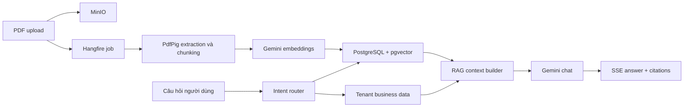

# FactoryMind

[](https://github.com/johnvo402/factory-mind/actions/workflows/ci.yml)

FactoryMind là MVP quản trị dữ liệu nhà máy kết hợp AI. Hệ thống quản lý máy móc, nguyên liệu, sản phẩm, tồn kho và lệnh sản xuất; đồng thời dùng Google Gemini và RAG để trả lời câu hỏi dựa trên dữ liệu doanh nghiệp hoặc tài liệu PDF có trích dẫn.

## Tính năng hiện có

- Đăng nhập bằng JWT, access token chỉ lưu trong RAM và refresh token nằm trong cookie `HttpOnly`.
- Phân quyền `Admin`, `Manager`, `User` bằng ASP.NET Core policies và Mediator authorization behavior.
- Chat Gemini dạng streaming qua Server-Sent Events.
- Hybrid RAG kết hợp semantic knowledge search và dữ liệu nghiệp vụ theo tenant.
- Upload PDF lên MinIO, xử lý nền bằng Hangfire, trích xuất nội dung, chunking, embedding và tìm kiếm bằng pgvector.
- Business evidence và document citations được lưu cùng câu trả lời chat.
- CRUD cho Machines, Materials, Products, Inventory và Production Orders.
- Import Excel có preview, mapping, validation theo dòng và transaction toàn bộ file.
- Dashboard KPI theo Company.
- Admin settings cho Company, Users và thông tin cấu hình AI an toàn.
- RFC 7807 Problem Details và FluentValidation cho Minimal APIs.
- Docker production cho API, Angular/Nginx, PostgreSQL/pgvector và MinIO.

## Kiến trúc

Backend áp dụng Clean Architecture Lite, CQRS và Repository Pattern theo từng feature. Dự án không dùng generic repository, generic Unit of Work, event bus hoặc database read/write tách biệt trong MVP.

```text
FactoryMind.Api             Presentation: Minimal APIs, auth, RFC 7807, SSE
FactoryMind.Application     CQRS commands/queries, handlers, policies, validators
FactoryMind.Domain          Entities, domain constants và constraints
FactoryMind.Infrastructure  EF Core, repositories, Gemini, MinIO, Hangfire, PDF/Excel
FactoryMind.Shared          Result, Error và contracts dùng chung thực sự
FactoryMind.Tests           Backend unit tests
frontend                    Angular application và frontend tests
docs                        Product, architecture, sprint và decision logs
```

Mỗi layer sở hữu service registration có `DependencyInjection.cs` riêng. `Program.cs` chỉ compose các layer và map endpoint groups.

### Luồng RAG



## Công nghệ

| Thành phần | Công nghệ |
| --- | --- |
| Backend | ASP.NET Core / .NET 9, Minimal APIs |
| Application | CQRS, source-generated Mediator, FluentValidation |
| Database | PostgreSQL 17, EF Core 9, pgvector |
| AI | Native Google Gemini API, `gemini-3.5-flash-lite`, `gemini-embedding-2` |
| Background jobs | Hangfire với PostgreSQL storage |
| Object storage | MinIO |
| Documents | PdfPig |
| Excel | ClosedXML |
| Frontend | Angular 20, Signals, RxJS, SCSS, marked |
| Delivery | Docker Compose, Nginx, GitHub Actions, GHCR |

Redis hiện chưa được triển khai vì chưa có use case cache/session được đo lường.

## Yêu cầu môi trường

- [.NET SDK 9](https://dotnet.microsoft.com/download/dotnet/9.0)
- Node.js `24.18.1` và npm
- Docker Desktop có Docker Compose
- Chrome hoặc Chromium để chạy frontend tests
- Gemini API key cho chat và embeddings

Kiểm tra phiên bản:

```powershell
dotnet --version
node --version
npm --version
docker compose version
```

## Chạy local

Các lệnh dưới đây được chạy từ thư mục gốc repository.

### 1. Tạo cấu hình local

```powershell
Copy-Item .env.example .env.local
```

Mở `.env.local` và cấu hình ít nhất:

```dotenv
GEMINI_API_KEY=your-local-gemini-key
```

`.env.local` đã được Git ignore. Không commit, log hoặc gửi API key lên repository.

### 2. Khởi động PostgreSQL và MinIO

```powershell
docker compose --env-file .env.local up -d
docker compose ps
```

Hai service phải có trạng thái `healthy` trước khi chạy API.

### 3. Chạy backend

Mở một PowerShell terminal mới tại thư mục gốc:

```powershell
Get-Content .env.local | ForEach-Object {
    if ($_ -and -not $_.TrimStart().StartsWith('#')) {
        $factoryMindPair = $_ -split '=', 2
        if ($factoryMindPair.Count -eq 2 -and $factoryMindPair[1].Length -gt 0) {
            Set-Item "Env:$($factoryMindPair[0].Trim())" $factoryMindPair[1]
        }
    }
}

dotnet run --project src/FactoryMind.Api
```

API tự động áp dụng EF Core migrations khi khởi động. Trong `Development`, initializer bổ sung idempotent các demo records còn thiếu mà không yêu cầu xóa volume.

### 4. Chạy frontend

Mở terminal khác:

```powershell
Set-Location frontend
npm ci
npm start -- --host 127.0.0.1 --port 4200
```

Angular development server proxy `/api` tới API tại `http://localhost:5047`.

### 5. Truy cập ứng dụng

| Dịch vụ | URL |
| --- | --- |
| FactoryMind UI | [http://127.0.0.1:4200](http://127.0.0.1:4200) |
| API health | [http://localhost:5047/health](http://localhost:5047/health) |
| MinIO Console | [http://localhost:9001](http://localhost:9001) |
| MinIO S3 API | `http://localhost:9000` |
| PostgreSQL | `localhost:5432` |

## Tài khoản Development

Các tài khoản dưới đây chỉ được tạo trong môi trường `Development` và dùng chung password `Demo@123`.

| Role | Email |
| --- | --- |
| Admin | `admin@factorymind.local` |
| Manager | `manager@factorymind.local` |
| User | `operator@factorymind.local` |

Development seed gồm:

- 1 Company
- 3 Users
- 6 Machines với nhiều trạng thái
- 5 Materials
- 4 Products
- 6 Inventory balances tại nhiều kho
- 5 Production Orders với nhiều trạng thái

Demo credentials và demo business records không được seed trong Production.

## Nhóm API chính

Tất cả business endpoints dùng prefix `/api` và tenant được lấy từ authenticated user, không nhận `CompanyId` tùy ý từ client.

| Route | Chức năng |
| --- | --- |
| `/api/auth` | Login, refresh, logout |
| `/api/conversations` | Conversation, message history, Gemini SSE chat |
| `/api/documents` | PDF upload, processing status, retry, re-index |
| `/api/knowledge/search` | Semantic knowledge search |
| `/api/dashboard/summary` | Tenant KPI summary |
| `/api/imports/excel` | Excel preview và transactional import |
| `/api/machines` | Machine CRUD |
| `/api/materials` | Material CRUD |
| `/api/products` | Product CRUD |
| `/api/inventories` | Inventory balance CRUD |
| `/api/production-orders` | Production order CRUD |
| `/api/settings` | Company, users và AI settings |

Endpoint contracts và route constants nằm trong `FactoryMind.Api/Routing/ApiRoutes.cs`.

## Chạy kiểm thử

### Backend

```powershell
dotnet restore FactoryMind.sln
dotnet format FactoryMind.sln --verify-no-changes --no-restore
dotnet build FactoryMind.sln --configuration Release --no-restore --warnaserror
dotnet test FactoryMind.sln --configuration Release --no-build --no-restore
```

### Frontend

```powershell
Set-Location frontend
npm ci
npm audit --omit=dev
npm run build
npm test -- --watch=false --browsers=ChromeHeadless
```

## Dừng hoặc reset local

Dừng API và frontend bằng `Ctrl+C` trong terminal tương ứng.

Dừng containers nhưng giữ dữ liệu:

```powershell
docker compose --env-file .env.local down
```

Xóa toàn bộ PostgreSQL và MinIO local data chỉ khi chủ động reset demo:

```powershell
docker compose --env-file .env.local down --volumes
```

Lệnh `--volumes` không thể khôi phục dữ liệu đã xóa.

## Production containers

Tạo file secrets riêng cho môi trường triển khai:

```powershell
Copy-Item .env.example .env.production
```

Cấu hình tối thiểu trong `.env.production`:

- `POSTGRES_PASSWORD`
- `MINIO_ROOT_USER`
- `MINIO_ROOT_PASSWORD`
- `JWT_KEY` mạnh, tối thiểu 32 ký tự và không dùng development key
- `GEMINI_API_KEY`
- `BOOTSTRAP_COMPANY_NAME`, `BOOTSTRAP_ADMIN_NAME`, `BOOTSTRAP_ADMIN_EMAIL`, `BOOTSTRAP_ADMIN_PASSWORD` khi database còn trống

Validate và chạy production topology:

```powershell
docker compose --env-file .env.production -f compose.prod.yaml config
docker compose --env-file .env.production -f compose.prod.yaml up -d --build
docker compose --env-file .env.production -f compose.prod.yaml ps
```

Production topology chỉ publish cổng Nginx frontend. Nginx phục vụ Angular và reverse proxy `/api` tới API private; PostgreSQL và MinIO chỉ nằm trong internal network.

Sau lần khởi tạo database đầu tiên, xóa các biến `BOOTSTRAP_*` khỏi deployment environment. API không đọc lại bootstrap credentials khi Company và User đã tồn tại.

Trước mỗi lần nâng cấp:

- Sao lưu PostgreSQL và MinIO volumes.
- Chọn image tag bất biến theo commit SHA thay vì chỉ dùng `dev`.
- Xác nhận health checks trước khi chuyển traffic.
- Chuẩn bị rollback image và người chịu trách nhiệm rollback.

TLS, domain và VPS deployment chưa được tự động hóa vì phụ thuộc hạ tầng đích và credentials vận hành.

## CI/CD

GitHub Actions chạy trên mọi push và pull request vào `dev`:

- Verify .NET formatting.
- Release build với warnings là errors.
- Chạy backend và frontend tests.
- Audit production npm dependencies.
- Publish API và frontend build artifacts.
- Với push vào `dev`, build và publish hai Docker images lên GHCR:
  - `ghcr.io/johnvo402/factory-mind-api:dev`
  - `ghcr.io/johnvo402/factory-mind-frontend:dev`
  - Hai image cũng có immutable tag theo commit SHA.

## Bảo mật

- Không commit `.env`, `.env.local`, `.env.production`, API keys hoặc production credentials.
- Key đã xuất hiện trong chat, log hoặc commit history phải được thu hồi và tạo lại.
- Access token chỉ tồn tại trong RAM của frontend.
- Refresh token dùng cookie `HttpOnly`; logout và token rotation thực hiện ở backend.
- API responses không trả password hash hoặc Gemini key.
- Production từ chối development JWT key và bootstrap password ngắn hơn 12 ký tự.
- Mọi business query và repository đều phải áp dụng tenant scope.

## Tài liệu

| Tài liệu | Nội dung |
| --- | --- |
| [`docs/01-vision.md`](docs/01-vision.md) | Vision và positioning |
| [`docs/02-prd.md`](docs/02-prd.md) | Product requirements |
| [`docs/03-ai-rag.md`](docs/03-ai-rag.md) | AI và RAG design |
| [`docs/04-database.md`](docs/04-database.md) | Database model và seed data |
| [`docs/05-backend.md`](docs/05-backend.md) | Backend conventions |
| [`docs/06-frontend.md`](docs/06-frontend.md) | Frontend architecture |
| [`docs/07-sprint.md`](docs/07-sprint.md) | Roadmap và implementation status |
| [`docs/decision-log`](docs/decision-log) | Architectural decisions |
| [`RULES.md`](RULES.md) | Quy tắc phát triển bắt buộc |

## Quy ước đóng góp

Trước khi thay đổi code:

1. Đọc `RULES.md` và tài liệu liên quan.
2. Kiểm tra decision logs hiện có.
3. Giữ CQRS command/query rõ ràng và feature-specific repositories.
4. Đưa code dùng chung vào `FactoryMind.Shared` chỉ khi thực sự được nhiều project hoặc feature sử dụng.
5. Giữ K&R brace style, Clean Code và SOLID.
6. Cập nhật tests và tài liệu cùng thay đổi.
7. Chạy đầy đủ quality gates trước khi commit.
